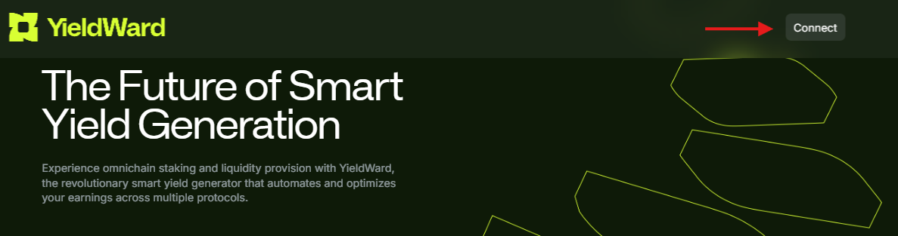

---
sidebar_position: 2
---

# Connect your wallet

To use YieldWard, connect your **Web3 wallet** to your YieldWard account:

1. If you don't have a wallet, create one. We support **420+ wallets** including the following:

	- 👉 [WalletConnect](https://walletconnect.com)
	- 👉 [MetaMask](https://metamask.io)
	- 👉 [Trust Wallet](https://trustwallet.com/ru)

2. Open [YieldWard homepage](https://yieldward.com) and click **Connect** in the top-right corner of the screen.

3. Choose a wallet to connect and authorize connection in this wallet.

4. That's it! After connecting, you'll be able to [stake](stake) one of the available currencies.

:::tip
If you wish to disconnect, click your wallet in the top-right corner and then click **Disconnect**.
:::
