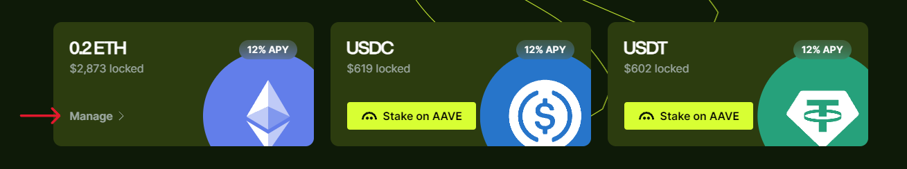

---
sidebar_position: 5
---

# Manage your stake

## Overview

After [staking](stake), you can always manage your stake: view its details, stake more, or claim your WARP bonuses.

:::warning
Please note that you'll be able to unstake and claim your [rewards](earn-rewards) only after the [Warden Protocol](https://wardenprotocol.org) and YieldWard go Mainnet. The only exception is [WARP bonuses](#claim-warp-bonuses).
:::

## Stake more

You can stake more at any moment:

1. Visit [YieldWard](https://yieldward.com).
2. On the main page, click **Manage** on your staked currency.
3. On the next screen, click **Stake More**.
4. Approve the transaction in your wallet. Wait until it's confirmed a nd click **Done**.

:::note 
When staking more, you can't change the **Warden address** for receiving rewards. However, you can specify another Warden address when staking another asset.
:::

## Claim WARP bonuses

For staking each of the Ethereum Mainnet assets, you receive boosted % yield (APY) in [WARP](https://docs.wardenprotocol.org/tokens/warp-token/warp) tokens in the Base Mainnet.

You can start claiming bonuses when the earned amount is above **100 WARPs**. Please note that you can claim only **all WARP at once**.

1. Visit [YieldWard](https://yieldward.com).
2. On the main page, click **Manage** on your staked currency.
3. Click **Bonuses**.
4. You'll see the total amount of WARP received for all stakes. Click **Claim**.
5. Approve the transaction in your wallet. Wait until it's confirmed.
6. If you wish to stake your WARP in the Base Mainnet, click **Stake**. Otherwise, click **Done**.

:::warning
Staking your WARP bonus will allow you to get more WARP from the 1:1.2 airdrop on the [Warden Protocol](https://wardenprotocol.org) Mainnet launch. Until then, your WARP will be locked.
:::

:::note
If you don't stake WARP immediately, you can do it later, as shown in [Stake WARP](stake#stake-warp).
:::
