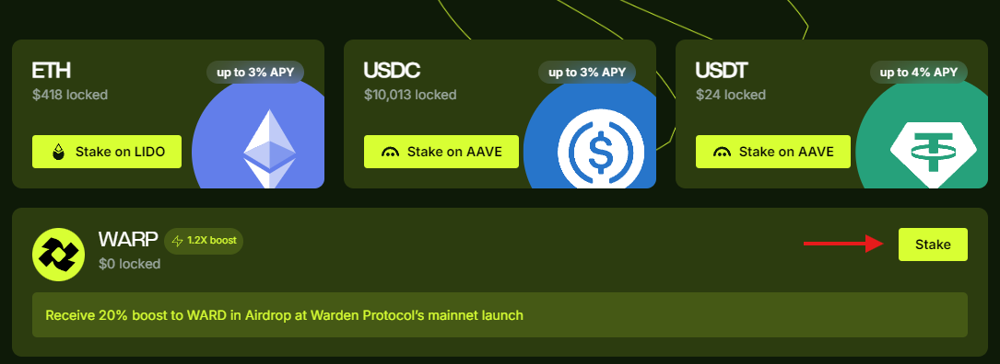

---
sidebar_position: 3
---

# Stake

## Overview

YieldWard allows you to **stake** (**deposit**) crypto and [earn rewards](earn-rewards) to your Warden address.

We currently support the following assets:

- **ETH**, **USDC**, **USDT** on the Ethereum Mainnet
- [WARP](https://docs.wardenprotocol.org/tokens/warp-token/warp) on the Base Mainnet

:::warning 
Please note that you'll be able to unstake and claim your rewards only after the Warden Protocol and YieldWard go mainnet. The only exception is [WARP bonuses](manage-your-stake#claim-warp-bonuses).
:::

## Stake ETH/USDC/USDT

You can stake **ETH**, **USDC**, or **USDT** on the Ethereum Mainnet. After the Warden Protocol mainnet launch, you'll receive **LP tokens** to your Warden address. Additionally, you'll earn **WARP tokens** on the Base Mainnet, which you can claim before the Warden mainnet launch.

1. Get a [Warden address in SpaceWard](https://help.wardenprotocol.org/spaceward/connect-your-wallet).
2. [Connect a Web3 Wallet](connect-your-wallet) to YieldWard.
3. Set the network of your connected wallet to **Ethereum Mainnet**.
4. Make sure that your wallet is funded with ETH and USDC/USDT if necessary.
5. Visit [YieldWard](https://yieldward.com).
6. Next to your preferred currency, click **Stake on LIDO** / **Stake on AAVE**.
7. In the next step, enter the amount to deposit and paste your Warden address.
8. Click **Stake**.
9. Approve the transaction in your wallet. Wait until it's confirmed and click **Done**.
10. That's it! Now you can check the details of your stake and stake more, as explained here: [Manage your stake](manage-your-stake).

## Stake WARP

You can stake Warden's [WARP token](https://docs.wardenprotocol.org/tokens/warp-token/warp) on the Base Mainnet and get [WARD](https://docs.wardenprotocol.org/tokens/ward-token/ward) from the **1:1.2 airdrop** at the Warden Protocol Mainnet launch:

1. Get a [Warden address in SpaceWard](https://help.wardenprotocol.org/spaceward/connect-your-wallet).
2. [Connect a Web3 Wallet](connect-your-wallet) to YieldWard.
3. Set the network of your connected wallet to **Base Mainnet**.
4. Make sure that your wallet is funded with ETH and WARP. To enable WARP in the wallet, use WARP smart contact address: `0x3c8665472ec5aF30981B06B4E0143663EBeDcc1E`.
5. Visit [YieldWard](https://yieldward.com).
6. Next to **WARP**, click **Stake**.
7. In the next step, enter the amount to deposit.
8. Click **Stake**.
9. Approve the transaction in your wallet. Wait until it's confirmed and click **Done**.
10. That's it! Now you can check the details of your stake and stake more, as explained here: [Manage your stake](manage-your-stake).

